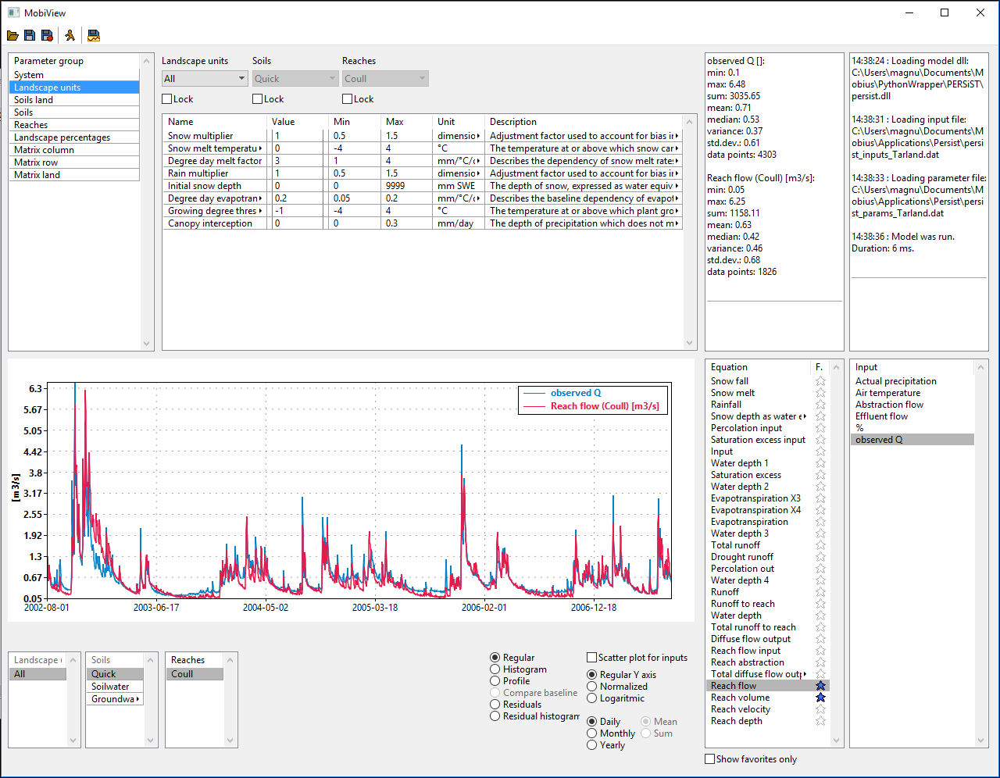

# MobiView

MobiView is a GUI for the model building system [Mobius](https://github.com/NIVANorge/Mobius)

MobiView can load and work with any Mobius model that has been compiled to a .dll using the Mobius dll interface. It understands the .dat format for parameters and inputs that is specified in the [Mobius file format documentation](https://github.com/NIVANorge/Mobius/blob/master/Documentation/file_format_documentation.pdf).

MobiView is made using the [Ultimate++](https://www.ultimatepp.org/) GUI library.

### Needed improvements (TODO list):
- Make plot aggregations for minute, hour, day available for models with a timestep size where this makes sense.

Optional:
- Equation search similar to parameter search?
- Allow saving various plot setups per model that can quickly be loaded in the AdditionalPlotView window.
- Do the model run in a separate thread, so that the GUI does not freeze during a model run, and so that you could potentially kill the model run if it seems to have encountered unrealistic values (or NaNs) and thus is taking too long. But this is tricky as it would require locking down the dataset (or running a copy of it and then writing back the results to the original one when it is done).
- Inbuilt autocalibration tools.

### Known issues:
Windows 10 may scale the layout of your programs, and for MobiView this can make the window too large for your screen if the screen resolution is not very high.
If this happens:
- Right click your desktop, choose 'display settings', then go to 'Change the size of text, apps, and other items' and set it to 100%.

If this does not work right away, you could
- either restart windows
- or right click MobiView.exe, then go to Settings->Compatibility, click 'Change high DPI settings', then check the first box under 'Program DPI', then change 'Use the DPI that's set for my main display when' to 'I open this program'.

This is not an ideal solution since it also changes the scaling of all your other programs and may make text hard to read. We will try to see if there is a better solution.

### Other known bugs (minor)
- Completely empty time series (all NaN) are sometimes plotted as a constant function with a random value

### Getting MobiView
If you are on Windows, you can download a MobiView .exe from ftp://mobiserver.niva.no

### Building MobiView yourself

If you want to build MobiView yourself (for instance to be guaranteed to always have the latest version or to make your own modifications), you can do the following:

- Download [Ultimate++](https://www.ultimatepp.org/) . If you are on Windows, choose the win32 portable archive (latest version of upp-mingw). **NOTE** You may have to download the nightly build, not the latest stable version, for everything to work. This is because we use some features that were recently implemented.
- Extract the archive somewhere. On Windows may need to install [7zip](https://www.7-zip.org/) to be able to extract it.
- If you are on Linux you first have to build the Ultimate++ ide. The instructions for this are at their website.
- Inside the upp folder, create a MyApps folder, and clone **this** repository to upp/MyApps/MobiView.
- Run upp/theide.exe
- In theide, select the MyApps folder and the MobiView project for loading and click ok.
- Windows: Where it says MingW Debug in the top bar, change it to MingW Release. Then click 'MingW Release' to get the output mode dialog. Change build method to 'MingWx64' and click ok.
- Linux: Where it says gcc debug in the top bar, change it to gcc release.
- Click the Execute button in the top bar (small icon with a green arrow on it). This will attempt to compile and run the project. The first time the compilation can take a few minutes since it has to build the entire Ultimate++ package.
- If all went well, it will now run a compiled MobiView. On Windows, the compiled exe will be located in upp/out/MyApps/MINGWx64.Gui
- Note that when MobiView is run from theide, the run directory is not the same as the location of the exe, and so it will not correctly read the settings.json file (so it will not remember what model you loaded the last time you ran it etc.). This is fixed by running the exe directly instead.
- **NOTE**: Sometimes when you recompile after having compiled once previously and then pulling updates from the MobiView repository, Upp does not recompile everything correctly. If you experience crashes, try to run a full rebuild (the red lightning icon).
