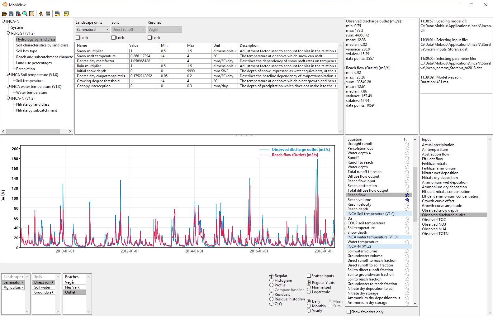

# MobiView

MobiView is a GUI for the model building system [Mobius](https://github.com/NIVANorge/Mobius)

MobiView can load and work with any Mobius model that has been compiled to a .dll using the Mobius dll interface. It understands the .dat format for parameters and inputs.

